# Sistema SEDUC

## Pré-requesitos:

Antes de tudo, verifique se você tem todos os softwares instalados no seu computador:
- [NodeJS](https://nodejs.org/pt-br/download)

## Passo a passo para a inicilização do projeto:
1. Instale todas as dependências:
```bash
  npm install
```
2. Rode o servidor:
```bash
  npm run server
``` 
3. Rode o client ( Você terá que abrir um novo terminal ):
```bash
  npm run start
```
4. Pronto, o servidor e o client já estão rodando!;
5. Para acessar o client localmente, basta entrar no seguinte link: [Site local](http://localhost:4200/)
6. Caso queira acessar de um deploy feito no Vercel, basta entrar no seguinte: [Site remoto](https://sistema-seduc-vitor.vercel.app/)

## Funcionalidades:
O sistema possui um sistema de cadastro, pesquisa, filtragem, visualização, modificação de usuários. Além de que, possui um sistema de login como segurança do sistema.

## Rotas
O projeto possui duas rotas: /dashboard e /login;

### Dashboard:
Nessa rota você consegue visualizar todos os usuários ( dependendo da sua permissão ), você precisa estar logado para poder acessa-la.

### Login:
A rota de login você irá preencher seus dados para que posso entrar no sistema. ( Essa rota só estará acessivel se você não estiver logado ).

## Usuário criados e suas permissões:
### Usuários:
Há alguns criados previamente para vocês poderem testarem livremente, são eles com seus nomes, cargos e emails:
1. Marcelo - Estudante - marcelo@gmail.com
2. Felipe - Estudante - felipe@gmail.com
3. Ronaldo Fenômeno - Estudante - r9rei@gmail.com
4. César - Estudante - cesar@gmail.com
5. David - Professor - david@gmail.com
6. Pedro - Professor - pedro@gmail.com
7. Vitor Hugo - Professor - vitorqueiroz325@gmail.com@gmail.com

Todos eles você consegue entrar com email e senha, que é 12345678.

**Obs.: Todas as senhas são criptografadas!**

### Permissões:
#### Estudantes:
Os estudantes conseguem apenas vizualizar outros estudantes e todos os professores.

#### Professores:
Os professores conseguem apenas vizualizar estudantes e outros professores, além de poder criar, editar e deletar estudantes.

#### Coordenadores:
Esses são os administradores, conseguem criar, vizualizar, editar e deletar todos, menos os próprios coordenadores.

**Obs.: Você terá que realizar o login para poder vizualizar usuários.**

## Screenshots:

### Dashboard
#### Estudante
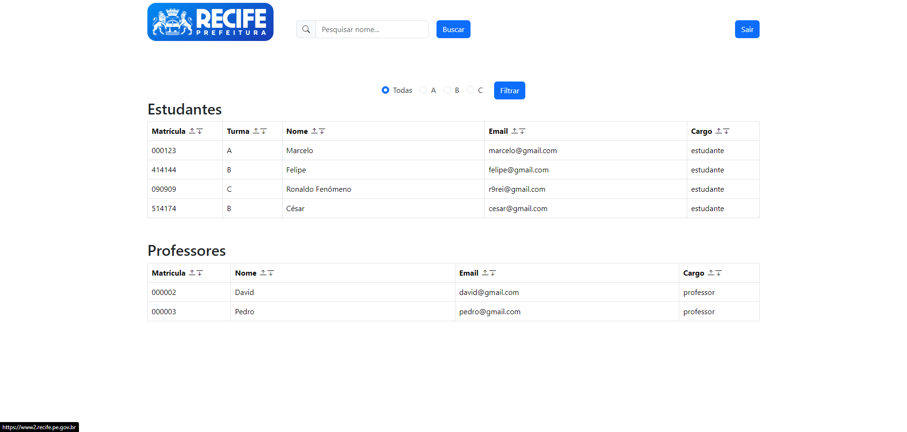
#### Professor
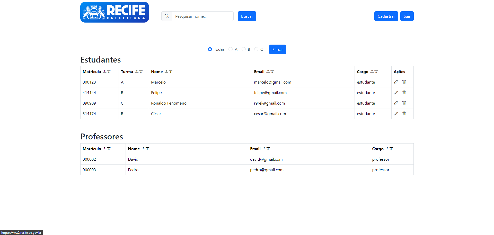
#### Coordenador
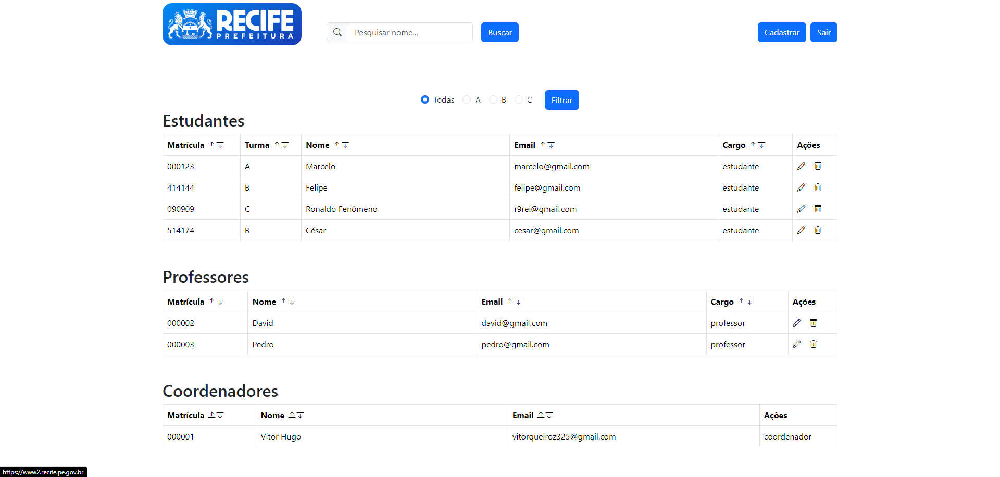

### Editar
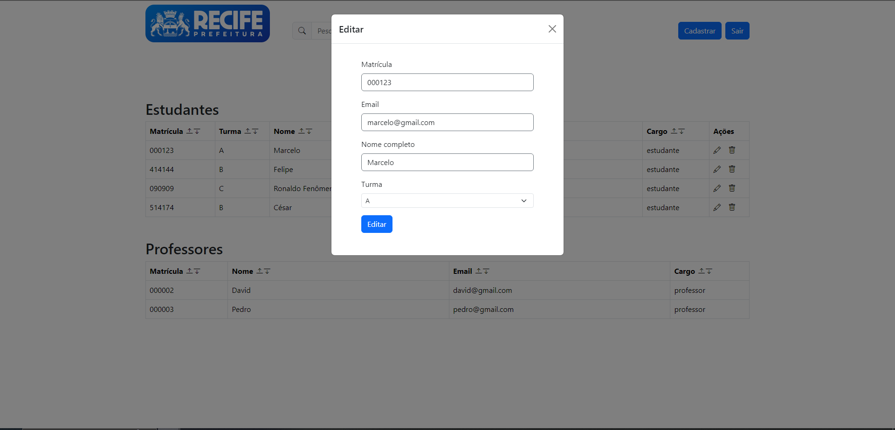

### Cadastro
### Com professor
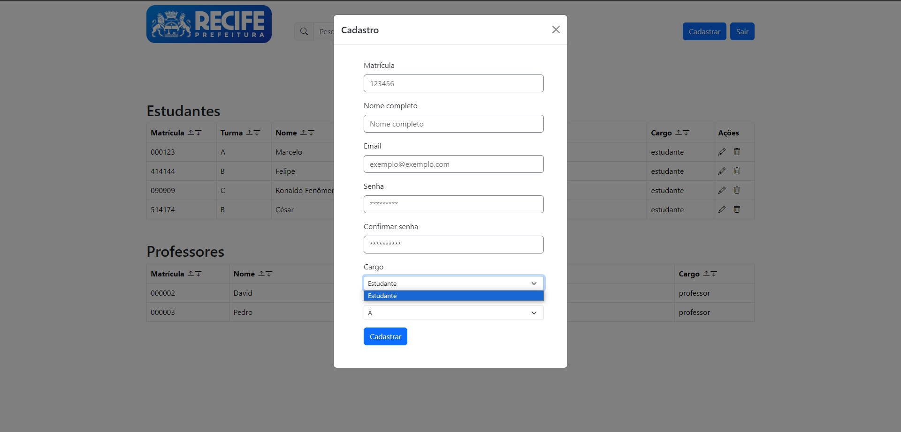
### Com coordenador
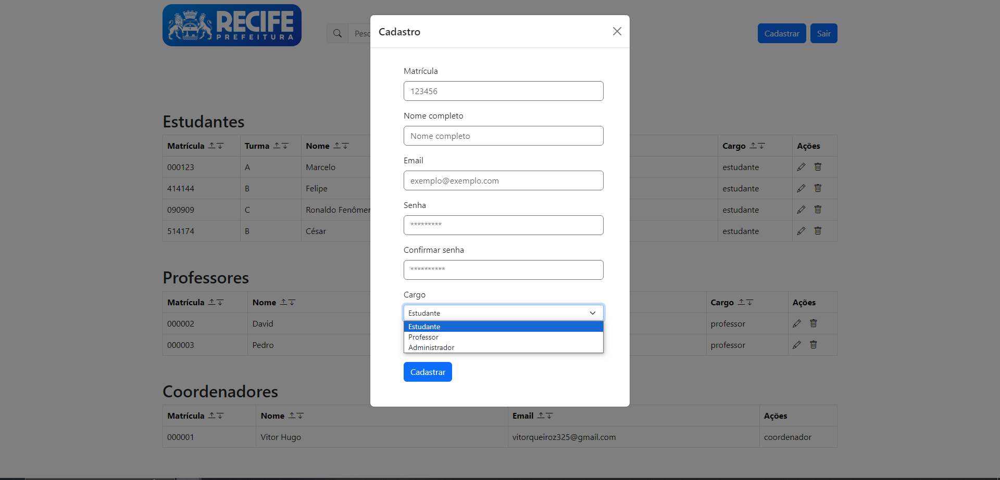
### Validação de inputs:
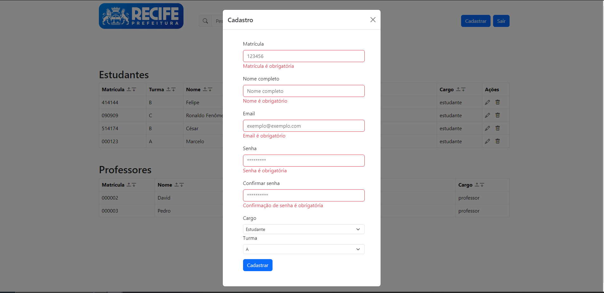
### Validação de usuários ( também tem de email )
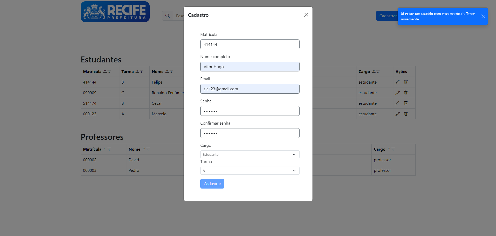

### Filtro
#### Filtrando apenas a turma B


### Pesquisa
#### Pesquisando o nome Ronaldo com filtro todos
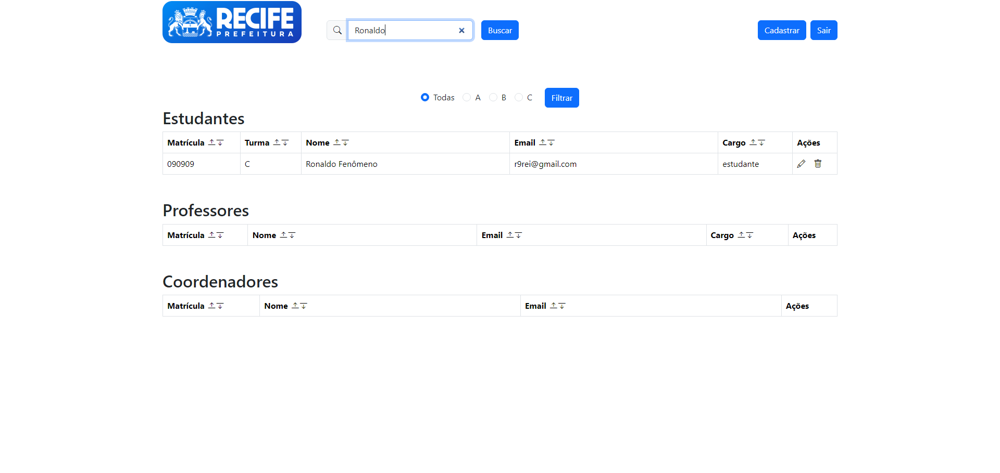
#### Pesquisando o nome Ronaldo com o filtro no A


### Login
#### Formulário de login 
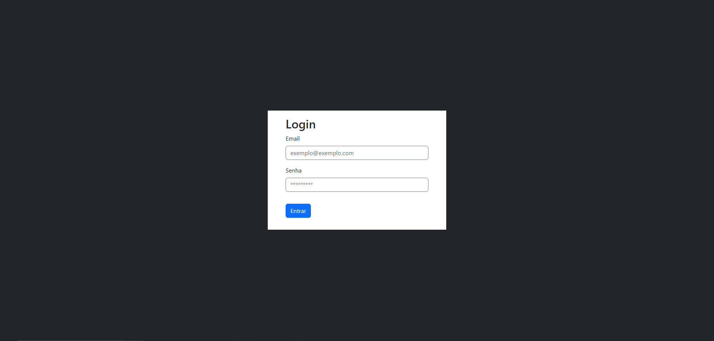
#### Validação de inputs:
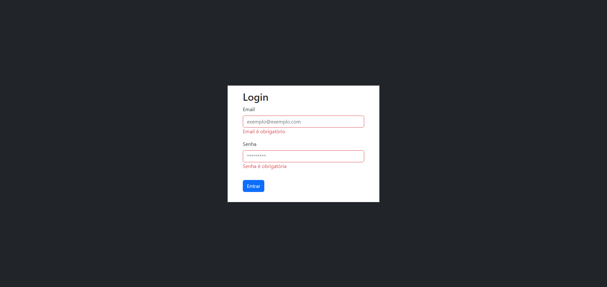


